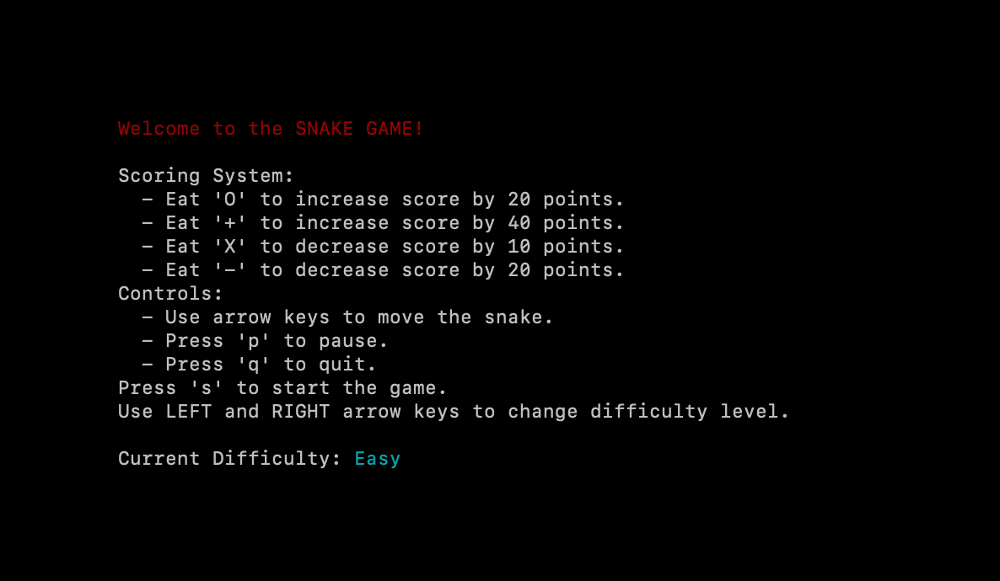
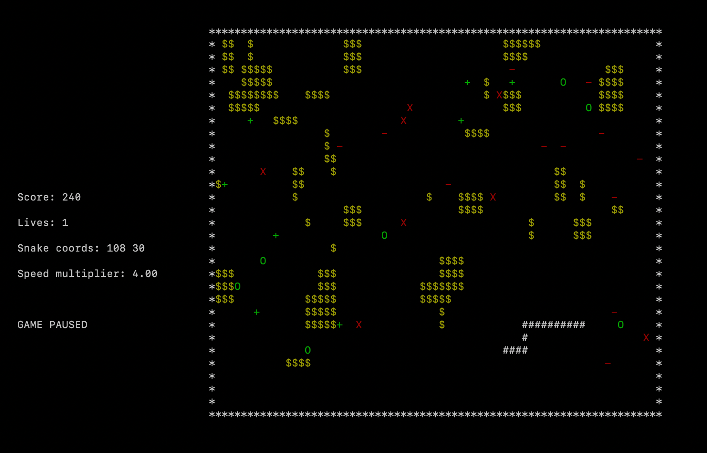
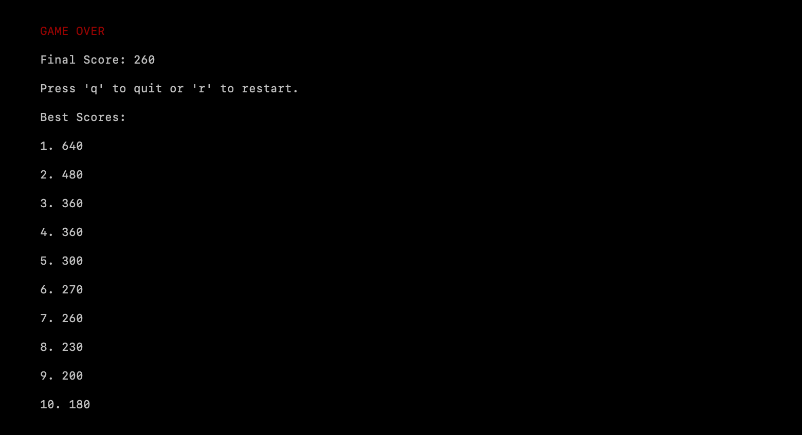

# Snake Game Project

## Overview
This project is a C++ implementation of the classic Snake game, developed as part of a university assignment. The game is built using the ncurses library to handle input and output within a terminal environment, making it a great example of handling low-level graphics and game logic.

## Features
- **Dynamic Snake Movement**: Control the snake using keyboard arrows. The game prevents reverse direction glitches.
- **Food Mechanics**: The snake grows or shrinks when eating different types of food, represented by '+' and '-' symbols. Additional food symbols have been introduced to vary the growth and shrinkage effects.
- **Scoring System**: Points are awarded based on the food eaten, with a display of the current score during gameplay. The scoring system is dynamic and changes as the game progresses.
- **Speed Variation**: As the score increases, the game's speed accelerates, increasing the difficulty. The speed adjustment is more pronounced at higher scores.
- **Pause and Quit Options**: The game can be paused with 'P' or 'p' and exited anytime using 'Q' or 'q'.
- **Obstacles**: Various obstacles appear in the game, which the snake must avoid to prevent death.
- **Lives**: Players start with three lives. Losing all lives results in a game over, but the score is carried over with each new life until all are lost.
- **Difficulty Levels**: Before starting the game, players can choose from three difficulty levels (Easy, Hard, Advanced), which affect the speed of the snake, the number of food items, and obstacles.
- **High Score Tracking**: The game saves the top 10 scores in a file, allowing players to compete for high scores.
- **Game Over Screen**: Displays the final score and a game over message when the player loses all lives or encounters a fatal obstacle.
- **Colorful Display**: The game features colorful representations for the snake, food, and obstacles, enhancing visual appeal and gameplay clarity.

## Screenshots
Here you should include screenshots of your game. Place them in your repository under a folder named `screenshots` and link them here using Markdown.



*Welcome Screen*


*Gameplay with the snake moving and eating food*


*Scoreboard*


## Installation
To run this game on your local machine, follow these steps:

1. Clone the repository:
   ```
   git clone https://github.com/yourusername/snake-game.git
   ```
2. Navigate to the project directory:
   ```
   cd snake-game
   ```
3. Compile the game using Make:
   ```
   make && ./game
   ```

## Usage
- Start the game by running the executable:
  ```
  ./game
  ```
- Use the arrow keys to move the snake.
- Press 'P' or 'p' to pause and resume the game.
- Press 'Q' or 'q' to quit the game.

## Contributing
Contributions to this project are welcome! Please fork the repository and submit a pull request with your enhancements.

## License
This project is licensed under the MIT License - see the [LICENSE.md](LICENSE) file for details.

## Acknowledgments
- Thanks to Northeastern University for the project guidelines and foundational code.
- Special thanks to my project supervisor Dr. Adeel Bhutta.

## Contact
For more information, please contact me at anya.trubelja@gmail.com.

